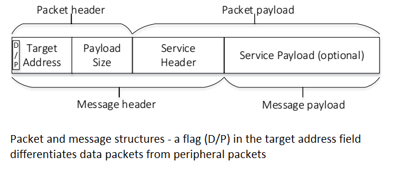
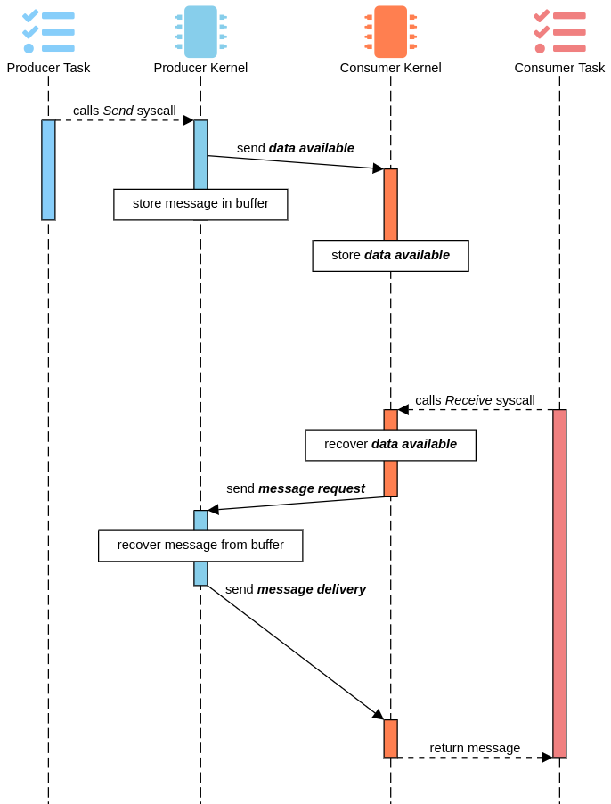
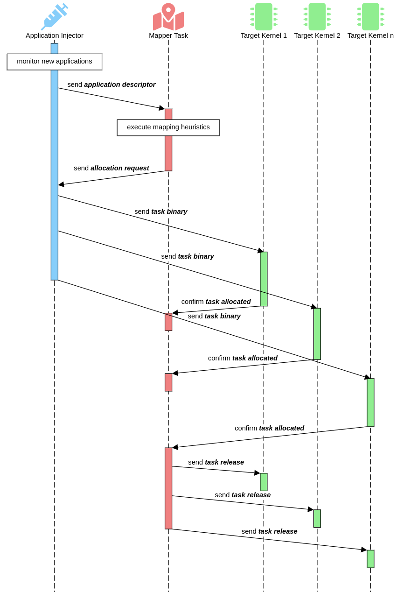
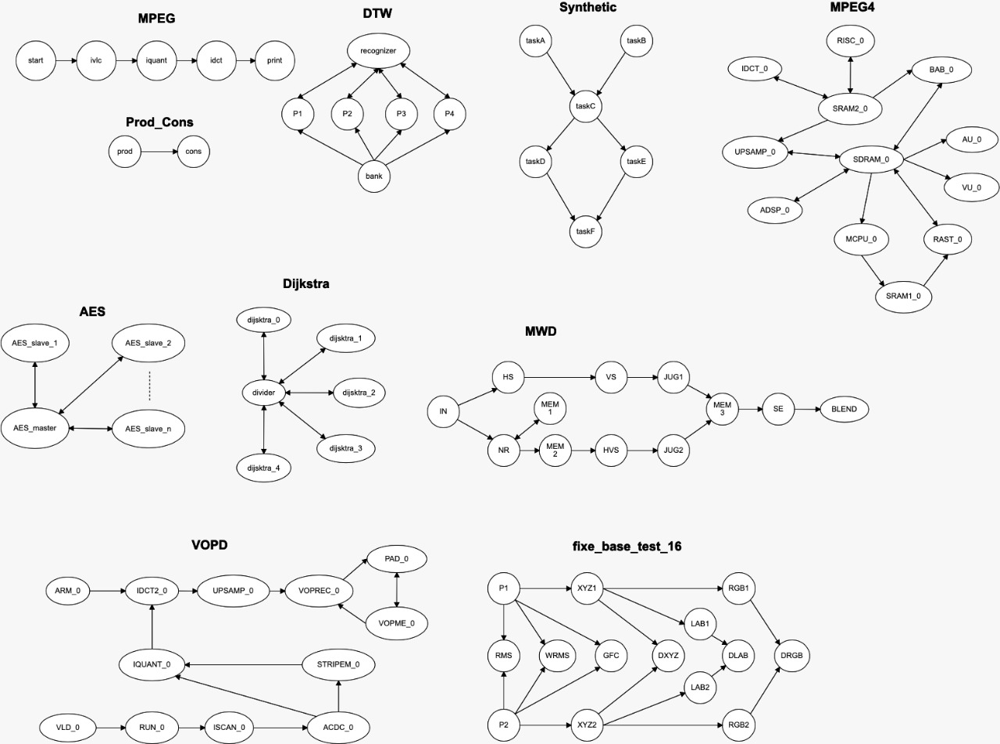

# MA-Memphis platform

## Overview

The image below pictures an overview of the MA-Memphis platform.

The many-core is composed of:
* **GPPC:** The GPPC contains a set of identical PEs that execute general purpose applications. 
  Each PE of the GPPC region contains:
	* **CPU:** The standard version of Mephis adopts a RISC-V (RV32IM_zicsr) processor.
  	A low integration effort is required to replace this processor with a different architecture.
	Besides the connection to the local memory, the processor has a connection to the DMNI enabling the management of the data transfers using the NoCs;
	* **DMNI:** The Direct Memory Network Interface merges two hardware modules: NI (Network Interface) and DMA (Direct Memory Access);
  	The advantage of the DMNI compared to the traditional PE implementation (NI+DMA) is a specialized module that directly connects the NoC router to the internal memory;
	* **Scratchpad memory:** The local memory is a true dual-port scratchpad memory, storing code and instructions.
  	The goal of using this memory model is to reduce the power consumption related to cache controllers and NoC traffic (transfer of cache lines).
	If some application requires a larger memory space than the one available in the local memory, it is possible to have shared memories connected to the system as peripherals;
	* **Packet-Switching:** Memphis adopts the Hermes Network-on-Chip comprising the the PS (Packet Switching) router of the figure above.
  	The main features of the wormhole PS router are: XY routing, round-robin arbitration, input buffering, credit-based flow control.
	* **BrNoC Router:** A lighter version of the BrNoC with removed unicast, the BrLite. This broadcast-based NoC sends message to TARGET or ALL PEs. It also has a set of 5 monitoring message classes dinamically configured by the platform to provide real-time monitoring without interfering in running user tasks. 
* **Peripherals:** Peripherals provide I/O interface or hardware acceleration for tasks running on the GPPC region. 
Examples of peripherals include shared memories, accelerators for image processing, communication protocols (e.g., Ethernet, USB), and Application Injectors.
The system requires at least two peripheral, the Application Injector and the MA Injector.
These peripherals are responsible for transmitting applications and the management application to be executed in the GPPC, repectively.

## Peripherals

The connection of peripherals is at the mesh NoC boundary ports due to the benefits of regular  floorplanning for the GPPC region, easing the physical synthesis with peripherals distributed along the GPPC boundary. 
The NoC router was modified in such a way to enable the communication with boundary ports.
Our NoC differentiates data packets from peripheral packets, as depicted in the figure from [overview](#overview).
Data packets are those exchanged by tasks running in PEs, and peripheral packets are those transferred between a task and a peripheral.
A peripheral packet arriving in a boundary PE goes to the peripheral, and not to the DMNI.

## Adding new peripherals

The MA-Memphis is bundled with the AppInjector and the MAInjector.
To create your own peripheral, check the [guide to add new peripherals](AddPeripheral.md).

## Packets

A data packet, in the figure below, from the NoC point of view, has a header and a payload.
The packet header contains the target router address and the payload size.
From the task point of view, a message contains: (i) message header: encapsulates the packet and service header (e.g., message reception, task mapping, request for a message); (ii) message payload: optional field. 
It may contain, for example, user data or object code of a task.

## Message Protocol

Each message exchanged between task to kernel, task to peripheral, and management task to management task, and vice-versa, uses a privileged communication API described in the picture below.

In the picture above, each step is:

1. The producer task calls a `Send` syscall, storing the message payload in a buffer and sending a `data available` packet to the consumer;
2. Upon receiving the `data available` packet, the consumer kernel stores in a buffer the producer ID and location;
3. Calling a `Receive` syscall, the consumer checks the FIFO buffer of `data available` messages for a ID and location to request a message via the `message request` packet;
4. The producer kernel, on receiving the `message request` packet, dispaches the message in its buffer with a `message delivery` packet.

## Application Injection

Applications may start at any moment in Memphis, characterizing a dynamic workload behavior.
To support the dynamic injection of new applications, it is necessary to deploy a protocol enabling the admission of new applications into the system. 
In MA-Memphis, the application can be injected by the AppInjector, while the Management Application is injected by the MAInjector due to security concerns. 
The figure below depics the injection protocol, which is generic, and may be deployed by other entities, as for example an Ethernet core. 

Each step of the figure above is:

1. The Injector monitors for new applications to arrive;
2. Then, it builds a packet containing the `application description` to the Mapper task;
3. The Mapper task executes its mapping heuristics;
4. The Mapper task then sends the mapping coordinates of all tasks inside an `allocation request` packet;
5. The Injector sends the binary of each task to each target PE mapped by the Mapper task;
6. The Kernel of each target PE sends a `task allocated message` to the Mapper task;
7. Finally, upon receiving the task allocated from all pending tasks, the Mapper sends a `task release` to all mapped tasks to release its execution.

## Applications

MA-Memphis runs _applications_ composed of _tasks_. 
A standard set of applications is included in [applications directory](/applications).
Each .c file inside an application folder is generated as a task.
The image below shows a communicating task graph model of almost all applications included:

To add a new application to MA-Memphis, you can add it directly to the [applications directory](/applications), or inside the application directory of a generated testcase.

## Management Application

The MA-Memphis main differential is being Application-managed.
The Management Application can be distributed between various many-cores.
The main advantage is leveraging the parallelism in management, by pipelining it into observation, decision and actuation tasks.
Another possibility is to parallelize the management into functions, i.e., separating, for example, DVFS management from migration management.
MA-Memphis is bundled with the following MA tasks:

* **RT Monitor (Obvservation):** Receives messages periodically from the kernel LLM (Low-Level Monitor) and detects if a deadline from a real-time task has been violated to send this information to the Decision task.
* **QoS Migration (Decision):** Stores information about the latest missed deadlines.
Upon accumulating parametrizable misses, requests for a task migration to the actuator.
* **Mapper Task (Actuation):** This task is responsible for task mapping and migration actuation.

Note that it is possible to have more than one of the same task in the system.
For example, with multiple QoS Observation tasks, the mapper will indicate to the kernel which is the nearest to send messages to.
Please also note that the mapper task should be the first in the yaml management list and should have its mapping static (to any desired PE).

## Adding new management tasks

It is possible to add new management tasks to the platform.
Check the [guide to add new management tasks](AddManagement.md).
